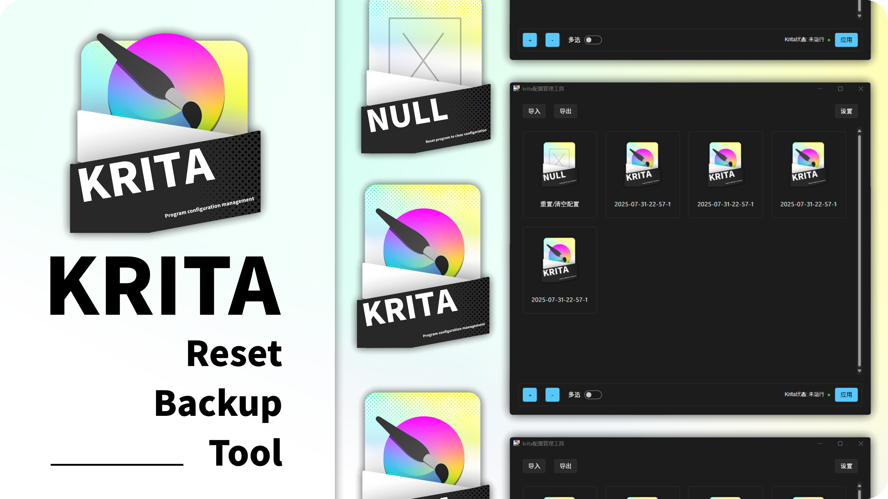

### KRITA 重置与备份工具

一个基于 Python Tkinter 的 GUI 工具，用于轻松重置或备份 Krita 的配置和资源文件。

[English](./README.md) | 简体中文

---

## 前言

作为编程初学者，我的代码可能略显杂乱。这是我第一个完整项目。



---

## 语言支持

- ​**多语言本地化**​：所有 GUI 显示文本均从 `./language/*.json` 动态加载。`ZH.json` 作为默认备用文件，若缺失将自动创建。当前已包含 `EN.json`。如您的语言未支持，可编辑/创建对应文件并提交。

---

## 计划功能

- [ ] ​**跨平台支持**​：因缺乏其他平台设备且不确定 Krita 在其中的运行机制，目前仅支持 Windows。平台相关代码集中在 `./platform_dependence` 包中，欢迎贡献！
  - [x] Windows
  - [ ] Mac OS
  - [ ] Linux
- [x] 正确重置 Krita
- [x] 创建可切换的 Krita 配置备份
- [x] 检测 Krita 是否正在运行
- [x] 通过 ZIP 文件导入/导出 Krita 备份
- [x] 正确处理非默认 Krita 资源路径

---

## 使用指南

功能直观简单：

1. 点击左下角 `+`/`-` 按钮创建/管理配置组
2. 点击 "应用" 切换 Krita 配置
3. 使用右上角 `设置` 按钮配置工具及查看信息
4. 使用 `导入/导出` 按钮共享配置

---

## 开发说明

安装依赖：

```
pip install sv_ttk pywinstyles pillow darkdetect
```

​**打包说明**​（使用 `pyinstaller`/`nuitka` 等）：  
打包后需将 `./resources` 和 `./language` 文件夹复制到根目录（与 .exe 文件同级）。

Windows 带图标打包命令（使用 `pyinstaller`）：

```
pyinstaller main.spec
```
